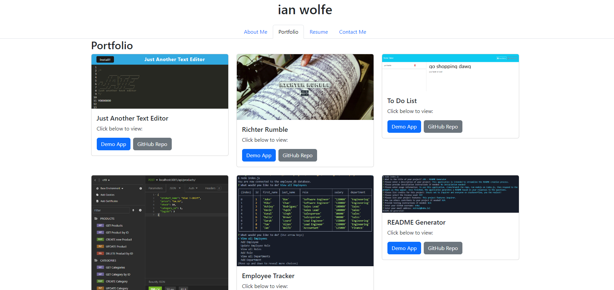

# c20-react-portfolio

## Description
  
This application serves as my professional portfolio.
  
## Table of Contents (Optional)
  
 - [Installation](#installation)
 - [Usage](#usage)
 - [Credits](#credits)
 - [Features](#features)
 - [Questions](#questions)
  
## Installation
  
No installation necessary.
  
## Usage
  
To view my portfolio, click [here](https://enkw-react-portfolio.netlify.app/).

Example:

  
## Credits
  
Ian Wolfe.
  
## Features
  
This project features .

## Questions

For any questions about this project, please visit my [GitHub](https://github.com/enkw).
